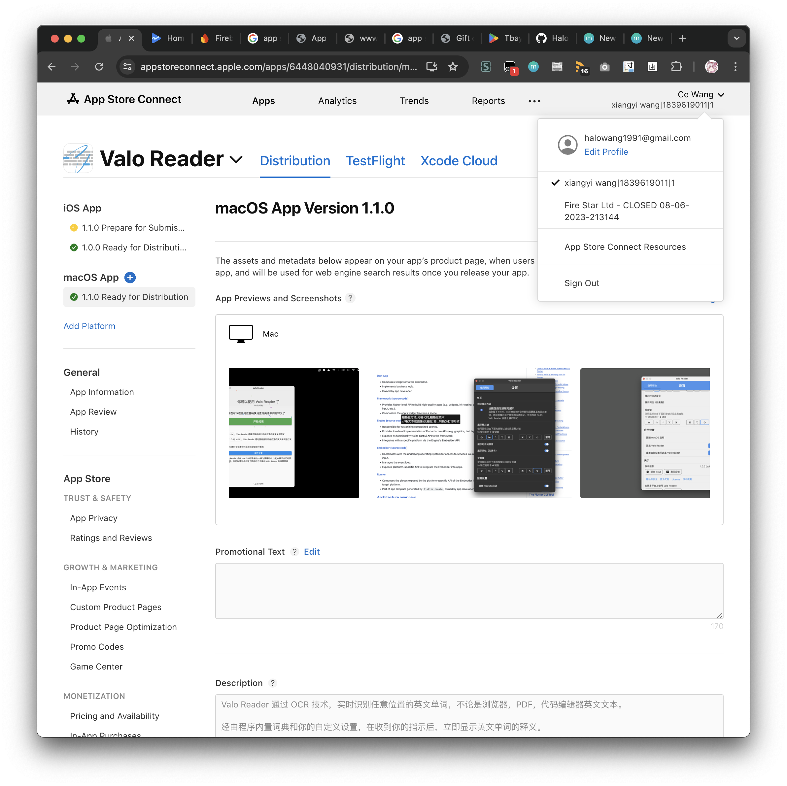
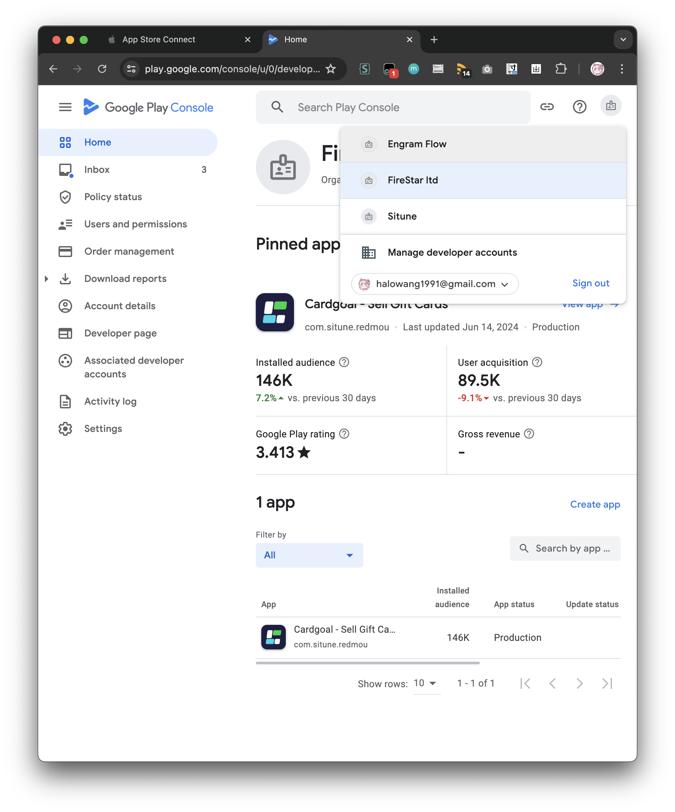
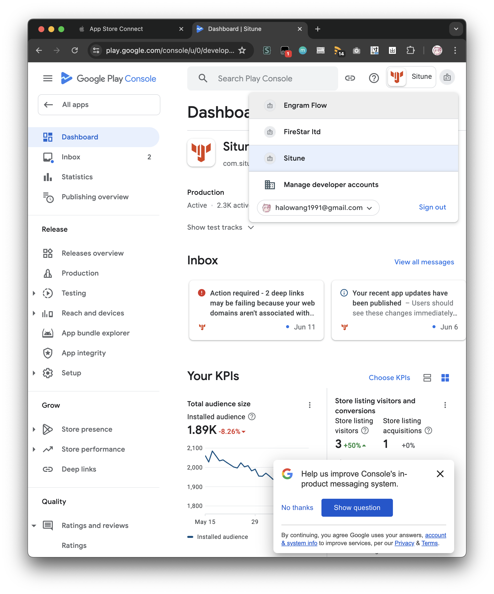

# flutter 候选人王策的项目

## 项目案例

### Valo Reader

该项目是我个人为了自己能在所有电子设备上以最快的速度(< 0.1s)查询到英语单词的释义，而自行设计和研发的一款产品。我目前已经将该产品部署在了 [macOS](https://apps.apple.com/cn/app/valo-reader/id6448040931) / [iOS](https://apps.apple.com/cn/app/valo-reader/id6448040931) / [Windows](https://github.com/HaloWang/valo-reader-doc/releases/download/1.0.0_107/babel-1.0.0+107-windows-setup.exe) / [Android](https://play.google.com/store/apps/details?id=com.df.mobile) / [Chrome 插件(早期原型)](https://github.com/HaloWang/english_flow) 这五个平台上。你可以点击上文中的链接或者前往[引导页](https://halowang.github.io/valo-reader-doc/)详细了解这款产品。

#### 链接

- [Home Page](https://halowang.github.io/valo-reader-doc/)
- [Mac App Store](https://apps.apple.com/us/app/valo-reader/id6448040931)
- [Play Store](https://play.google.com/store/apps/details?id=com.df.mobile)
- [iPhone App Store](https://apps.apple.com/us/app/valo-reader/id6448040931?platform=iphone)
- [Source Code of Tampermonkey Script](https://github.com/HaloWang/english_flow)
- [技术概要](https://halowang.github.io/valo-reader-doc/blog/tech_detail_macos)

#### 证明

Apple 开发者后台截图

### Tbay - 杭州曦腾科技有限公司

这是一款礼品卡交易平台。其业务模式为用户在该平台出售礼品卡，平台确定礼品卡可用后向用户账户转账。在 [Google Play Store](https://play.google.com/store/apps/details?id=com.gonglian.tbay&hl=en&gl=US) 和 [App Store](https://apps.apple.com/us/app/gift-card-on-tbay/id6472409948)（国区 Apple ID 无法下载）均可下载使用。这款 App 面向的主要用户生活在尼日利亚和美国。

该项目中，我负责 Android 与 iOS 部分，其技术栈包括：Flutter, Android(Java+Kotlin), iOS(ObjC), hybird(native+js)

#### 链接

- [Play Store](https://play.google.com/store/apps/details?id=com.gonglian.tbay&hl=en)
- [App Store (Light)](https://apps.apple.com/us/app/gift-card-on-tbay/id6472409948)

### Cardgoal - 杭州曦腾科技有限公司

同上述的 [Tbay - 杭州曦腾科技有限公司](#tbay---杭州曦腾科技有限公司) 一样，这也是一款礼品卡交易平台，实在同一家公司的的内部竞争产品，是上一款 App 的轻量版。

我完全独立地用纯 Flutter 开发了该 App，并在 App 中接触到了公司的诸多核心业务

#### 链接

- [Play Store](https://play.google.com/store/apps/details?id=com.situne.redmou&hl=en)

#### 证明

Google Play 开发者后台截图

### Situne - 杭州曦腾科技有限公司

这是一款面向海外市场的跨境电商平台。其包含一个电商 App 所有的功能。

我完全独立地用纯 Flutter 开发了该 App，并在该项目中广泛地使用了第三方登录，分享，支付(Opay/Flutterwave/Paystack)，分析统计(firebase)等诸多国外第三方平台 API

- [Play Store](https://play.google.com/store/apps/details?id=com.situne.shop&hl=en)
- [App Store](https://apps.apple.com/us/app/situne/id6443579510)

#### 证明

Google Play 开发者后台截图

### 名丝 - 杭州和聊科技股份有限公司

这是一款使用 React Native 实现的移动应用。我作为移动端负责人带领了 4 名移动开发完成了该项目

- [App Store](https://apps.apple.com/az/app/%E5%90%8D%E4%B8%9D%E7%BE%8E%E5%8F%91%E6%95%99%E8%82%B2/id1566811877)

### 和聊 - 杭州和聊科技股份有限公司

- [App Store](https://apps.apple.com/hk/app/%E5%92%8C%E8%81%8A-%E4%BA%BA%E8%84%89%E6%88%90%E5%B0%B1%E4%BA%8B%E4%B8%9A/id542575938)

### 轻课堂 - 杭州和聊科技股份有限公司

- [App Store](https://apps.apple.com/cn/app/%E8%BD%BB%E8%AF%BE%E5%A0%82/id1423061917)

## 总结

- 我能独立完成将一个 App 从开发到上架的全部流程，包括
  - 开发者账号注册与申请
  - 用户界面设计
  - 在 iOS / Android / Windows / macOS / Web 上进行编码实现
  - 打包程序并上传至各大应用市场
  - 根据反馈及时修改 bug，通过上传新包或者热更新的方式解决 bug
- 我的技术栈如下，按照熟练程度和经验从高到低排序
  - Flutter / dart
  - iOS / macOS / UIKit / ObjC / Swift
  - Android / Java / Kotlin
  - Web / React / React Naitve / Taro.js / Ant Design
  - Windows / C++ / win32 / winrt
